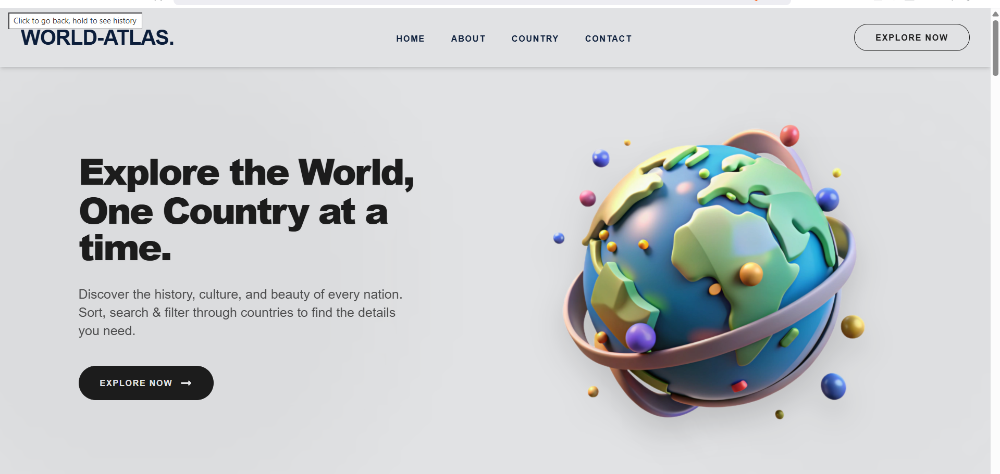
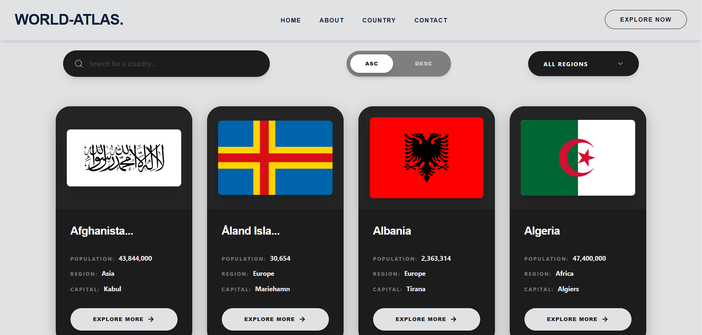
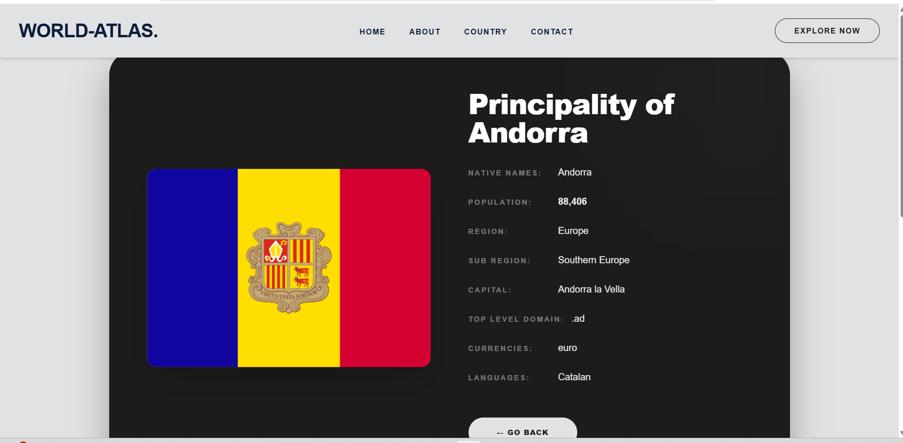

# 🌍 World Atlas - Explore the Globe

World Atlas is a premium React application that allows users to explore detailed information about every country on Earth. Featuring a sleek dark-themed UI, real-time search, regional filtering, and advanced sorting, it provides a seamless experience for discovering the world's diverse cultures and geography.

## 🚀 Live Demo

*Home Page with a stunning 3D globe visualization.*


*Country list with real-time search, Asc/Desc sorting, and Region filters.*


*Side-by-side details view with comprehensive national data.*

## 🛠️ Technology Stack
- **Frontend**: React.js (v18+)
- **Build Tool**: Vite
- **Styling**: Tailwind CSS & Vanilla CSS
- **Routing**: React Router DOM (v6)
- **API Handling**: Axios
- **Icons**: Lucide React / SVG Icons
- **Data Source**: [RestCountries API](https://restcountries.com/)

## 📂 Folder Structure
```text
world-atlas/
├── src/
│   ├── api/                # Axios configurations and API calls
│   ├── assets/             # Images, demos, and static assets
│   ├── components/
│   │   ├── Layout/         # Layout-specific components (AppLayout, CountryItem)
│   │   └── UI/             # Reusable UI components (Header, Footer, Loader)
│   ├── pages/              # Page components (Home, About, Country, Details)
│   ├── App.jsx             # Main application component & Routing
│   ├── App.css             # Global styles and animations
│   └── main.jsx            # Application entry point
├── public/                 # Public assets
├── .gitignore              # Git ignore rules
├── LICENSE                 # MIT License
├── package.json            # Project dependencies and scripts
└── README.md               # Project documentation
```

## ⚙️ Installation & Usage

1. **Clone the repository**:
   ```bash
   git clone https://github.com/Ayush-Raghuwanshi-Dev/World-Atlas.git
   ```

2. **Navigate to the project directory**:
   ```bash
   cd world-atlas
   ```

3. **Install dependencies**:
   ```bash
   npm install
   ```

4. **Start the development server**:
   ```bash
   npm run dev
   ```

5. **Open in browser**:
   Navigate to `http://localhost:5173`.

## 📄 License
Distributed under the MIT License. See `LICENSE` for more information.

## ✉️ Contact
**Ayush Raghuwanshi** - [ayushraghuwanshi@example.com](mailto:ayushraghuwanshi@example.com)
- **GitHub**: [Ayush-Raghuwanshi-Dev](https://github.com/Ayush-Raghuwanshi-Dev)
- **Project Link**: [https://github.com/Ayush-Raghuwanshi-Dev/World-Atlas](https://github.com/Ayush-Raghuwanshi-Dev/World-Atlas)

---
*Developed with ❤️ for the world of web development.*
